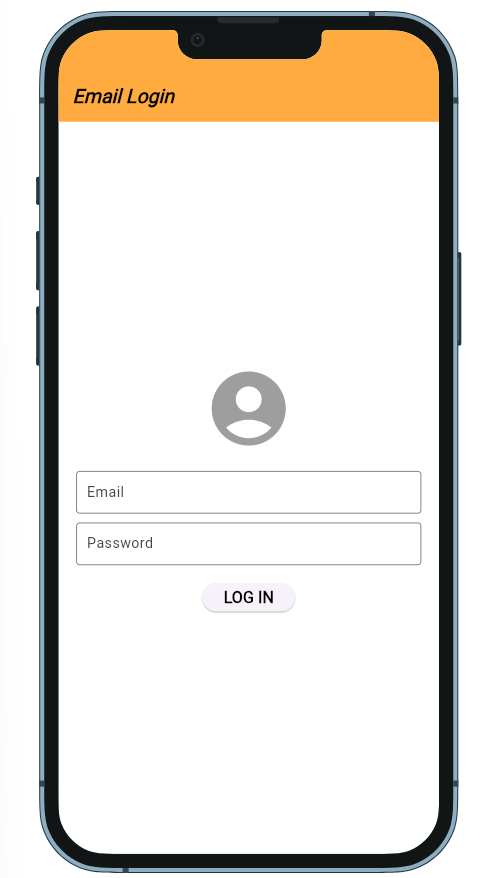

# Flutter Login App with Shared Preferences

This is a simple **Flutter login screen** that saves the user's email and password using `shared_preferences`.  
When the app is restarted, the credentials are **automatically loaded** from storage.

## 🚀 Features
✅ **Login Screen** with Email & Password Fields  
✅ **Data Persistence** using `shared_preferences`  
✅ **Email Format Validation**  
✅ **Error Handling** for Empty Fields  
✅ **Snackbar Messages** for Feedback

## 📸 App Preview


## 👉 Live Demo


## 🛠️ Dependencies
Make sure to add the required package in `pubspec.yaml`:
```yaml
dependencies:
  flutter:
    sdk: flutter
  shared_preferences: ^2.2.2  # Check for latest version
```

## 📄 Code Overview

### 📌 **1. Load Saved Credentials**
```dart
_loadSavedCredentials() async {
  SharedPreferences prefs = await SharedPreferences.getInstance();
  setState(() {
    emailController.text = prefs.getString('email') ?? '';
    passwordController.text = prefs.getString('password') ?? '';
  });
}
```

### 📌 **2. Save Credentials**
```dart
_saveCredentials() async {
  SharedPreferences prefs = await SharedPreferences.getInstance();
  await prefs.setString('email', emailController.text);
  await prefs.setString('password', passwordController.text);
}
```

### 📌 **3. Validate Email Format**
```dart
bool _isValidEmail(String email) {
  String emailPattern = r'^[a-zA-Z0-9._%+-]+@[a-zA-Z0-9.-]+\.[a-zA-Z]{2,}$';
  RegExp regex = RegExp(emailPattern);
  return regex.hasMatch(email);
}
```

### 📌 **4. Handle Login with Validation**
```dart
void _handleLogin() {
  String email = emailController.text.trim();
  String password = passwordController.text.trim();

  if (email.isEmpty || password.isEmpty) {
    _showSnackBar("⚠️ Email and Password cannot be empty!");
  } else if (!_isValidEmail(email)) {
    _showSnackBar("❌ Invalid Email Format! Example: user@example.com");
  } else {
    _saveCredentials();
    _showSnackBar("✅ Login Successful & Data Saved!");
  }
}
```

### 📌 **5. Show Snackbar Messages**
```dart
void _showSnackBar(String message) {
  ScaffoldMessenger.of(context).showSnackBar(
    SnackBar(
      content: Text(message, style: TextStyle(fontSize: 16)),
      backgroundColor: Colors.redAccent,
      behavior: SnackBarBehavior.floating,
    ),
  );
}
```

